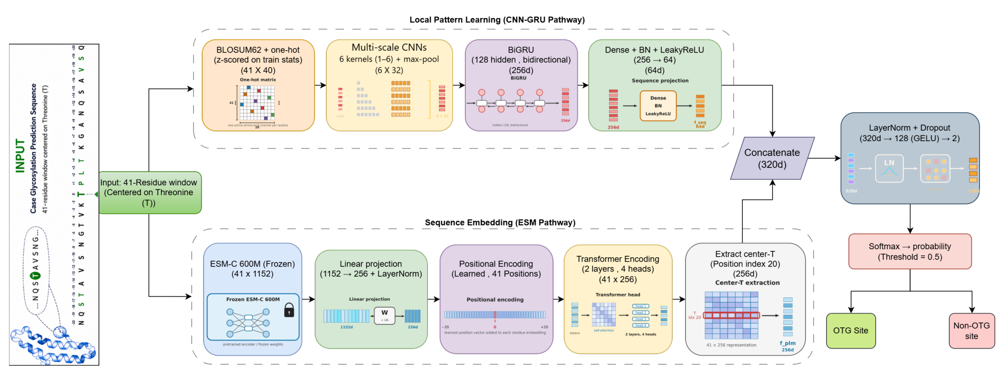
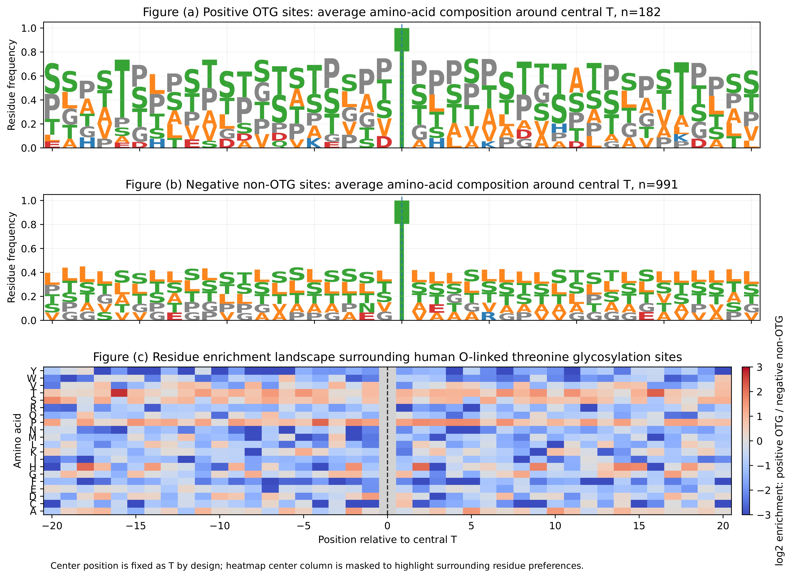

# ESMC-OTG

[](https://colab.research.google.com/github/Offpass/ESMC_OTG_Prediction/blob/main/ESMC_OTG.ipynb)

ESMC-OTG predicts human O-linked threonine glycosylation sites from 41-residue protein sequence windows centred on threonine. The model combines contextual protein representations with a separate pathway for local sequence patterns.



## Model

The contextual branch uses the frozen ESM-C 600M checkpoint distributed as [`Synthyra/ESMplusplus_large`](https://huggingface.co/Synthyra/ESMplusplus_large). Per-residue embeddings are projected to 256 dimensions, passed through a two-layer transformer encoder, and reduced to the representation of the central threonine. The local branch combines BLOSUM62 and one-hot residue features with multi-scale convolutions and a bidirectional GRU. The two branch representations are concatenated and passed to a small classifier.

Training uses five stratified folds across seven random seeds, giving 35 fitted models. The final probability is the mean of their predictions. Mixup, label smoothing, early stopping, and validation-gated stochastic weight averaging are used during training; the decision threshold is 0.5.

## Data and evaluation

| Split | Positive | Negative | Total |
|---|---:|---:|---:|
| Training | 879 | 878 | 1,757 |
| Balanced benchmark | 200 | 200 | 400 |
| Imbalanced test | 182 | 991 | 1,173 |

The supplied balanced benchmark contains 19 sequences that also occur in the training files. The imbalanced test contains no exact training-sequence overlaps, so it is the stronger estimate of performance under a realistic class distribution.



## Running the notebook

Install the dependencies below. For GPU runs, use a PyTorch build compatible with the installed CUDA driver.

```bash
pip install -r requirements.txt
```

Run [`ESMC_OTG.ipynb`](ESMC_OTG.ipynb) from the repository root. The notebook finds the tracked `data` folder automatically; `OTG_DATA_DIR` can be set when the data are stored elsewhere. An NVIDIA GPU is recommended for embedding extraction and training. Development variants are kept in [`notebooks/ablations`](notebooks/ablations).

## Results

Values are mean ± standard deviation across seven seeds.

| Test set | MCC | Accuracy | Sensitivity | Specificity |
|---|---:|---:|---:|---:|
| Balanced benchmark | 0.8177 ± 0.011 | 0.9079 ± 0.005 | 0.8771 ± 0.015 | 0.9386 ± 0.020 |
| Imbalanced test | 0.6907 ± 0.027 | 0.9032 ± 0.014 | 0.8650 ± 0.017 | 0.9102 ± 0.019 |

For context, [DeepOTG](https://pubmed.ncbi.nlm.nih.gov/42025727/) reported MCC values of 0.807 on its balanced test and 0.737 on its imbalanced test. Detailed ESMC-OTG metrics are available in [`results/main_metrics.csv`](results/main_metrics.csv).
